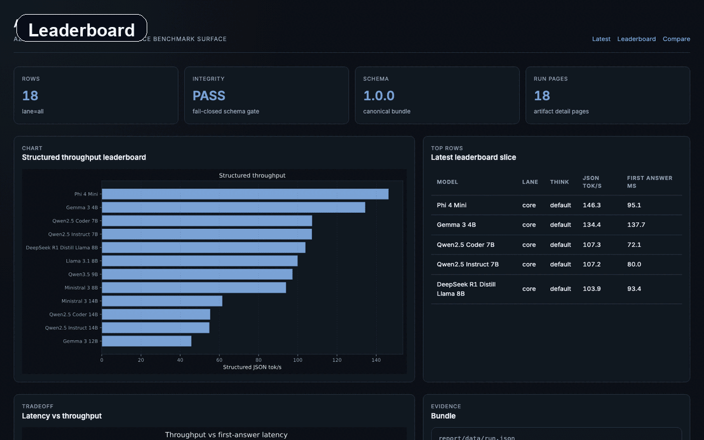
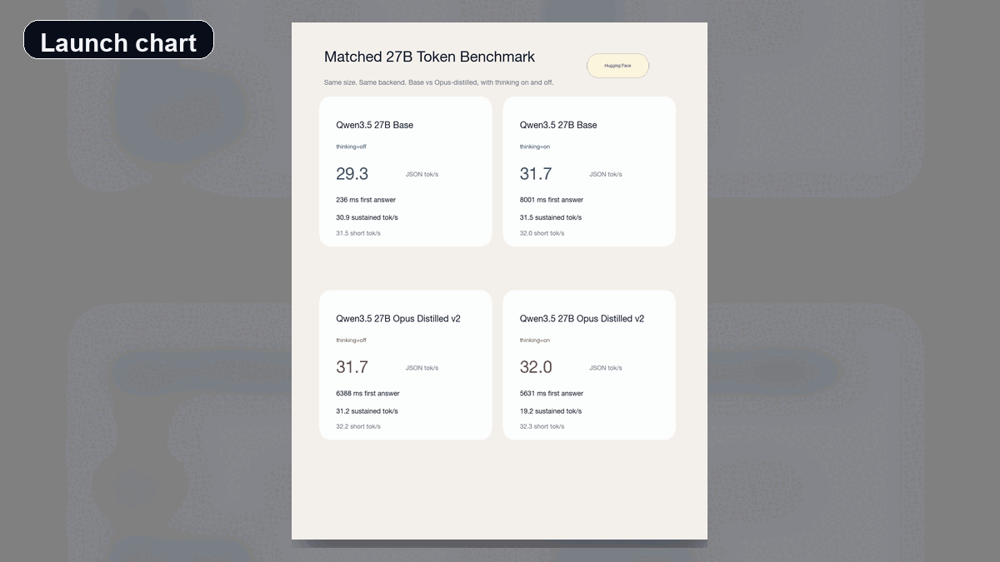

[](https://github.com/cjchanh/azimuth-bench/actions/workflows/ci.yml)
[](LICENSE)

# Azimuth Bench

<p align="center"><strong>Artifact-backed local LLM benchmarking with static reports and explicit comparability limits.</strong></p>

<p align="center">
  <a href="https://github.com/cjchanh/azimuth-bench/releases/tag/v0.1.0">v0.1.0 release</a>
  ·
  <a href="https://cjchanh.github.io/azimuth-bench/report/index.html">Live sample report</a>
  ·
  <a href="docs/azimuth_bench/SOURCE_OF_TRUTH.md">Source of truth</a>
  ·
  <a href="release/public/v0_1_0/README.md">Launch pack</a>
</p>

<p align="center">
  <a href="https://cjchanh.github.io/azimuth-bench/report/index.html">
    
  </a>
</p>

**Azimuth** is a portable inference benchmark surface. It runs throughput suites against MLX, OpenAI-compatible, and Ollama backends, writes inspectable artifacts, and builds static report pages plus JSON bundles you can compare without trusting a hosted dashboard.

**Canonical package:** `azimuth_bench`  
**Canonical CLI:** `azbench`  
**Distribution name in `pyproject.toml`:** `azimuth-bench`

## Why this is useful

| Surface | What you get |
| --- | --- |
| Throughput runs | Structured JSON tok/s, sustained tok/s, first-answer latency, validity, provenance |
| Static report | Leaderboard, compare, per-run pages, provider/protocol/machine views |
| Export path | Markdown summaries plus deterministic share SVGs |
| Merge path | Multiple validated Azimuth run trees merged into one report with explicit blockers |

The point is not "one magic leaderboard." The point is a benchmark/report pipeline that keeps the evidence attached to the numbers.

## Fresh launch batch

<p align="center">
  
</p>

For launch I also ran a fresh local batch and turned it into a small visual pack. The results note is here:

- [release/public/v0_1_0/FRESH_BATCH_2026-04-01.md](release/public/v0_1_0/FRESH_BATCH_2026-04-01.md)

Important caveat: that fresh batch is intentionally labeled as mixed provenance.

- Core rows came from an existing local `openai_compatible` serving path on `:8080`.
- Frontier 27B thinking rows came from a dedicated MLX benchmark lane on `:8001`.
- Useful and real, but not a fake universal apples-to-apples ranking.

## Implemented today

- Throughput suite with MLX, OpenAI-compatible, and Ollama adapters.
- `azbench report build` -> static HTML + `report/data/*.json` with sanitized public paths.
- `azbench export markdown` -> report-derived Markdown summaries.
- `azbench export svg` -> deterministic leaderboard and compare share cards.
- `azbench report build <primary> --include-run-dir <other> ...` -> validated multi-run merge.
- Provider / protocol / machine / per-run report surfaces with comparability metadata.

**Compatibility only:** `signalbench/*` is a shim, and `benchmarking/*` delegates into `azimuth_bench`. New code should import `azimuth_bench`.

## Not implemented

- Production `llama.cpp` / `vLLM` adapters.
- Hosted SPA or live benchmark service.
- PyPI automation.

See [docs/azimuth_bench/SOURCE_OF_TRUTH.md](docs/azimuth_bench/SOURCE_OF_TRUTH.md) for the exact implemented-vs-not-implemented boundary.

## 5-minute quickstart

```bash
git clone https://github.com/cjchanh/azimuth-bench.git && cd azimuth-bench
python3 -m venv .venv && source .venv/bin/activate
pip install -e ".[dev]"
```

### Build the sample report

Uses committed `benchmarks/` artifacts. It does not rerun benchmarks.

```bash
azbench report build benchmarks --repo-root "$(pwd)"
```

### Merge two run trees

Each input must already look like a normal Azimuth `benchmarks/` directory with a token summary plus referenced artifacts.

```bash
azbench report build /path/to/primary_bench --repo-root "$(pwd)" --include-run-dir /path/to/other_bench
```

### Export Markdown

```bash
azbench export markdown benchmarks --output /tmp/azimuth_summary.md
```

### Regenerate share cards

```bash
azbench export svg benchmarks --output-dir benchmarks/report/exports
```

### Run throughput

Requires a live backend. Adapter and environment notes live in [docs/azimuth_bench/ENVIRONMENT.md](docs/azimuth_bench/ENVIRONMENT.md).

```bash
azbench bench throughput --help
```

Legacy entrypoints still resolve to the same CLI: `signalbench`, `python -m signalbench`, `python -m azimuth_bench`, `python -m benchmarking.token`.

## Evaluator path

- [docs/azimuth_bench/DESIGN_PARTNER_EVAL.md](docs/azimuth_bench/DESIGN_PARTNER_EVAL.md)
- [release/evaluator/README.md](release/evaluator/README.md)
- [docs/azimuth_bench/METHODOLOGY.md](docs/azimuth_bench/METHODOLOGY.md)
- [docs/azimuth_bench/READING_REPORTS.md](docs/azimuth_bench/READING_REPORTS.md)
- [docs/azimuth_bench/PUBLIC_PROOF_PACK.md](docs/azimuth_bench/PUBLIC_PROOF_PACK.md)

## Verify

```bash
ruff check . && ruff format --check .
python3 -m pytest -q
```

Optional local packaging check:

```bash
pip install build
python -m build --outdir /tmp/azimuth_dist
```

## License

MIT — see [LICENSE](LICENSE).
